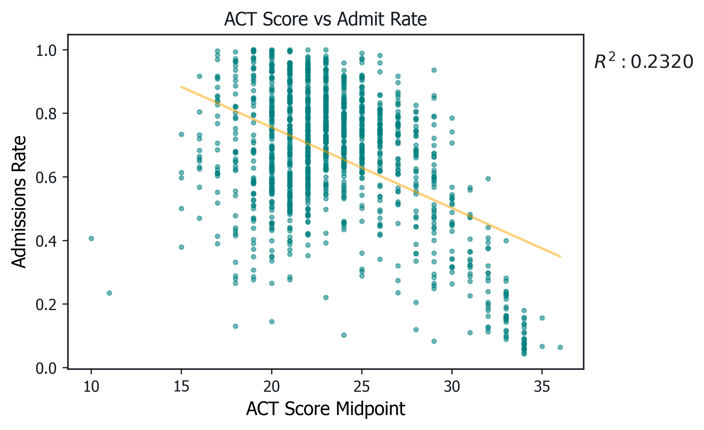
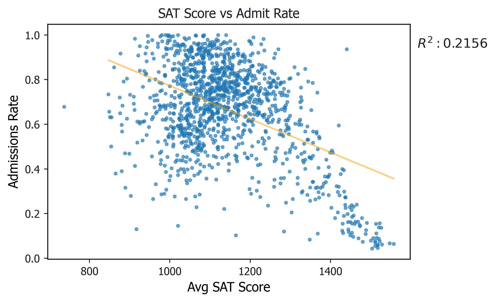
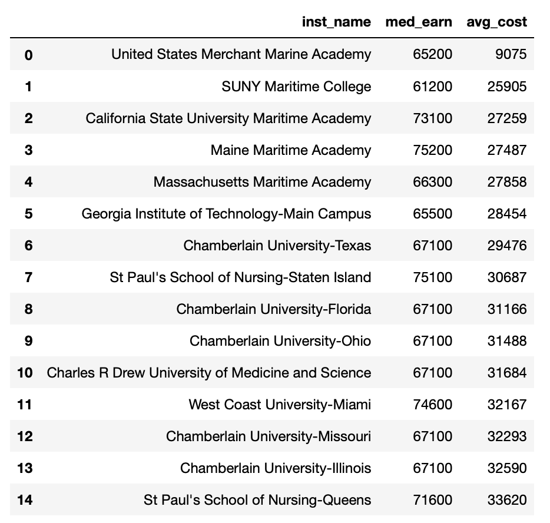

# College-Programs
## Goals
Our goals with this project are to:
- Learn database querying with MySQL
- Connect queries with Python
- Learn more about US colleges through the [Department of Education College Scorecard database](https://collegescorecard.ed.gov/data/)
- Create a GUI that allows users to perform custom searches over the database (work in progress)

Our deliverable is:
- A normalized database out of the College Scorecard
- A set of queries that provide interesting information about colleges
- Matplotlib graphs to help show our findings
- A Python program that provides a GUI linked with our database (work in progress)

This project is largely inspired by this one: https://github.com/dlwhittenbury/MySQL_IMDb_Project. We took many methods from what that project did with python and connecting python with SQL. 

## Methods
The College Scorecard database consists of two types of tables——**All Data Elements**, which lists various data points and statistics for each university/college; and **Field of Study**, which lists information about each degree offered at a particular university/college——both for various years. For our analysis, we focused on the most recent version of these tables, from 2019-2020, to be as up-to-date as possible. 

The problem, however, is that these tables are extremely wide. All Data Elements has over 2000 columns. This is a bit unwieldy, so we decided to split it into smaller tables that focused on what we're interested in analyzing.

This is roughly all the areas of data contained in the College Scorecard:

This is the normalized, relational database we decided to create from it:

We used Python in **college_normalization.py** to read in the raw csvs and output csvs and tsvs (because degree names have commas, having them as csvs doesn't work). (To be consistent, we should ultimately change them to all be tsvs).

Note that the **Broad CIP Areas** table did not come from the College Scorecard but was copied and parsed from [this site](https://nces.ed.gov/ipeds/cipcode/browse.aspx?y=56). This is because (some background) CIP (Classification of Instructional Programs) codes are [6-digit numbers that identify programs on 3 levels](https://ucblueash.edu/offices/administrative/institutional-research/cipcode.html). The College Scorecard only uses the first 4 digits and gives a distinct program name to each 4-digit combination. _However_, there are thousands of these 4-digit combinations, so for an analysis of different subject areas it would be more helpful to have fewer categories. The first 2 digits specify a broad subjedct area, of which there's only 50 or so. But the College Scorecard doesn't tell us what the first 2 digits stand for, so we have to look it up online. 2-digit CIP codes are also used in the **Program Percentages** table.

After making our new, smaller tables, we loaded them into a MySQL database with **create-tables.sql** and **load-data.sql**. Now we could perform queries using MySQL workbench or however we want. Some are listed in **Queries.sql**.

To connect our queries with Python, we used the [mysql.connector](https://dev.mysql.com/doc/connector-python/en/) package. Data visualization was performed in a Jupyter Notebook.

## Findings
### First, we were interested in how important test scores are to admissions rates. 
Note that this data is from 2019-2020, before a lot of schools became test-optional. Perhaps if we had more recent data, the results would be different.

Here are scatterplots relating ACT and SAT scores to admissions rate:

They're extremely similar, first of all.
Next, perhaps the linear regression line wasn't the best choice, because it doesn't show how for both graphs there's essentially two sections. For low to medium scores, it's just a big uncorrelated blob. However, as scores start getting into the decent to high range (>27 ACT and >1300 SAT), a linear pattern emerges where higher scores = more competitive (or perhaps the more competitive schools require higher scores).

### Second, we wanted to know if more expensive schools led to better career results.
So we again did scatterplots relating cost of attendance to job placement and median earnings 6 years after enrollment (presumably after they've graduated 2-ish years):

Job placement can be high regardless of cost, but it does seem more secure at more expensive schools (less range).

Median earnings seems to be our strongest correlation yet, so we included a little equation. However, it is still full of anomalies. One of them is the band of schools with far higher earnings than expected for their cost, which we decided to investigate with a table (excepting the extreme outliers):

### Third, we were interested in the outcomes of different types of institutions (public, private, and for-profit).

### Finally, we looked at how different areas of study compared in their career outcomes.
The cumulative average of each programs's median earnings:

And job placement:

Note that most cells in this data had the value "PrivacySuppressed", which we treated as a Null. This forced us to reduce the areas of study we investigated to those with over 100 entries to get a reasonable sample size (because most of those entries are PrivacySuppressed for earnings and percent working values). 

It's also interesting that some degrees with low earnings have higher job placement than those with higher earnings. However, since the values are all very close for this one, perhaps it may be within the margin of error.

## TODO:
This project is a work in progress, so here are plans for the future

Need to do:
- normalize Program_Percentages so we can look at area of study popularity
- **Make the GUI**

Potentially could try:
- perhaps we can use the College Scorecard API to make this work better
 - https://github.com/RTICWDT/open-data-maker/blob/master/API.md
- since we have data for past years, perhaps we could eventually incorporate that as part of our analysis
- maybe denormalization would be more efficient considering how pretty much every query invovles a join?

